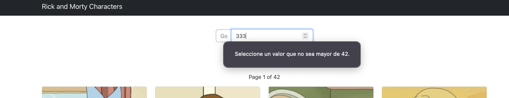

# Rick and Morty consumer App

 Front-end only SPA project for practising and learning about REACT.

## Project Structure

- Relevant dirs and its scripts and files

```txt
$ tree -I 'node_modules|docs'
.
├── README.md
├── package-lock.json
├── package.json
├── public
│   ├── favicon.ico
│   ├── index.html
│   ├── manifest.json
│   ├── robots.txt
│   └── styles
│       └── bootstrap-5.2.0
│           ├── css
│           │   └── bootstrap.min.css
│           └── js
│               └── bootstrap.bundle.min.js
└── src
    ├── App.css
    ├── App.js
    ├── components
    │   ├── Characters.js
    │   ├── Navbar.js
    │   └── Pagination.js
    ├── context
    │   └── StaticContext.js
    ├── functions
    │   ├── characterUtils.js
    │   └── textUtils.js
    ├── index.css
    └── index.js

```

## UI - Views

- First page header and some results view


- Second page  view


- Second page buttom view


- Last page view


- Warning on page number input view


